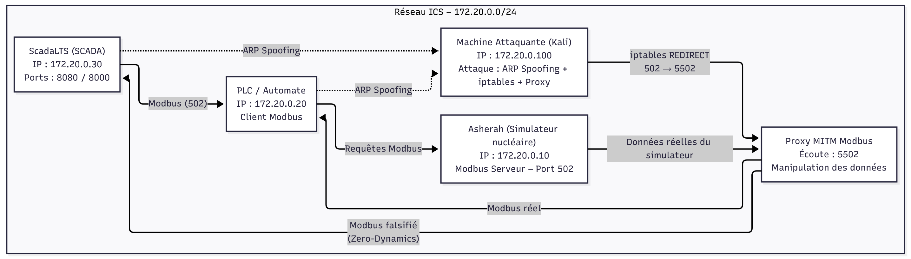

# Nuclear-ICS

Simulation d'une infrastructure ICS/SCADA vulnérable et sécurisée pour l'étude des cyberattaques industrielles.

Ce projet permet de déployer une simulation incluant :

* Un SCADA (ScadaLTS)
* Un PLC basé sur Asherah/MBans simulant une centrale nucléaire
* Un poste attaquant avec outils MITM, replay, spam, etc.
* Suricata pour l’IDS
* Elastic Stack (Logstash + Kibana) pour la supervision
* Un firewall avec règles dédiées ICS
* Plusieurs modes de déploiement : **vulnérable** et **sécurisé**

---

## Structure du projet

```
Nuclear-ICS/
├── docker-compose.yml                 # Services communs
├── docker-compose.vulnerable.yml      # Version volontairement vulnérable
├── docker-compose.secured.yml         # Version sécurisée (IDS/Firewall/Isolement réseau)
│
├── scada-config.json                  # Configuration SCADA ↔ PLC
│
├── asherah/
│   ├── Dockerfile
│   └── start_asherah.sh               
│
├── attacker/
│   ├── Dockerfile
│   ├── startup.sh
│   ├── scripts/
│   │   ├── arp_mitm.sh                # MITM ARP automatique
│   │   ├── mitm_replay_attack.py      # Proxy et attaque par rejeu Modbus
│   │   ├── modbus_controller.py       # Écriture/lecture dans les registres
│   │   ├── monitoring_realtime.py     # Suivi en temps réel
│   │   ├── spam_attack.py             # Flood Modbus
│   │   └── recorded_values.json       # Trace des valeurs capturées
│   └── logs/
│       └── proxy.log
│
├── scadalts/
│   ├── Dockerfile
│   └── startup.sh
│
├── scada_db/
│   └── Dockerfile
│
├── suricata/
│   ├── Dockerfile
│   ├── config/suricata.yaml
│   ├── rules/ics-custom.rules         # Détection attaques ICS
│   ├── rules/modbus-custom.rules
│   └── logs/
│
├── logstash/
│   ├── config/logstash.yml
│   └── pipeline/ics-pipeline.conf
│
├── kibana/
│   └── config/kibana.yml
│
├── firewall/
│   ├── firewall-rules.sh
│   └── scripts/setup.sh
│
└── README.md
```

---

## Démarrage de la simulation

### 1. Construire et lancer les services


#### Mode vulnérable (aucune protection)

```bash
docker-compose -f docker-compose.yml -f docker-compose.vulnerable.yml up --build
```

#### Mode sécurisé (Suricata + firewall + pipeline ELK)

```bash
docker-compose -f docker-compose.yml -f docker-compose.secured.yml up --build```
```
---

## Interfaces disponibles

Une fois les services démarrés :

| Service                      | URL / Adresse                                                      | Identifiants                      |
| ---------------------------- | ------------------------------------------------------------------ | --------------------------------- |
| **ScadaLTS**                 | [http://localhost:8081/Scada-LTS](http://localhost:8081/Scada-LTS) | `admin / admin`                   |
| **Asherah Modbus (PLC)**     | TCP `localhost:5020`                                               | —                                 |
| **Kibana (monitoring)**      | [http://localhost:5601](http://localhost:5601)                     | `elastic / changeme` (par défaut) |
| **Suricata Logs (Eve JSON)** | `suricata/logs/eve.json`                                           | —                                 |

---

## Poste attaquant

Entrer dans le conteneur :

```bash
docker exec -it --privileged attacker_station bash
cd /root/scripts
```

### MITM + attaque par rejeu

```bash
./arp_mitm.sh
```

Ce script lance :

* ARP spoofing
* Le proxy Modbus malveillant
* Le monitoring en direct

### Modifier les registres Modbus

Dans un second terminal :

```bash
python3 modbus_controller.py
```

---

## Mode sécurisé : IDS + Firewall + ELK

En mode sécurisé, les protections suivantes sont actives :

### Suricata

* Règles ICS personnalisées
* Règles Modbus dédiées (détection Modbus write, scans, replay)

### Firewall

* Règles dédiées Modbus/ICS
* Blocage du MITM ARP
* Filtrage des flux SCADA/PLC

### Logstash + Kibana

* Pipeline Logstash ICS
* Dashboard de surveillance industrielle
* Analyse des attaques (alerts Suricata, anomalies Modbus)

---

## Architecture réseau (attaque MITM)

Une fois l’attaque lancée :



En mode sécurisé : 
```
┌──────────────────────────────────────┐
│   PLC Network (10.100.1.0/24)        │
│   ┌──────────────┐                   │
│   │   Asherah    │                   │
│   │     .10      │                   │
│   └──────┬───────┘                   │
└──────────┼───────────────────────────┘
           │
      ┌────▼────┐                        ┌─────────────────────────────────────┐
      │Firewall ┼───────────────────────►│ Monitoring Net (10.100.3.0/24)      │
      │  .254   │                        │  ┌───────────┐   ┌──────────────┐   │
      └────┬────┘                        │  │ Suricata  │──►│Elasticsearch │   │
           │                             │  │ (IDS)     │   │    .10       │   │ 
┌──────────▼──────────────────────────┐  │  └───────────┘   └──────┬───────┘   │
│  SCADA Network (10.100.2.0/24)      │  │                         │           │
│   ┌──────────────┐  ┌────────────┐  │  │  ┌───────────┐   ┌──────▼───────┐   │
│   │   ScadaLTS   │  │ MySQL DB   │  │  │  │ Filebeat  │──►│  Logstash    │   │
│   │     .10      │──│    .20     │  │  │  │   .40     │   │    .20       │   │
│   └──────────────┘  └────────────┘  │  │  └───────────┘   └──────────────┘   │
│   ┌──────────────┐                  │  │                                     │
│   │  Attacker    │                  │  │  ┌──────────────┐                   │
│   │    .100      │                  │  │  │   Kibana     │                   │
│   └──────────────┘                  │  │  │     .30      │                   │
└─────────────────────────────────────┘  │  └──────────────┘                   │
                                         └─────────────────────────────────────┘
```
---

## Ressources


* **SCADA-LTS**
  [https://github.com/SCADA-LTS/Scada-LTS](https://github.com/SCADA-LTS/Scada-LTS)

* **Modbus Specifications**
  [https://www.modbus.org/modbus-specifications](https://www.modbus.org/modbus-specifications)

* **Simulation Asherah Nuclear Power Plant (MBans)**
  [https://github.com/ait-cs-IaaS/mbans](https://github.com/ait-cs-IaaS/mbans)

